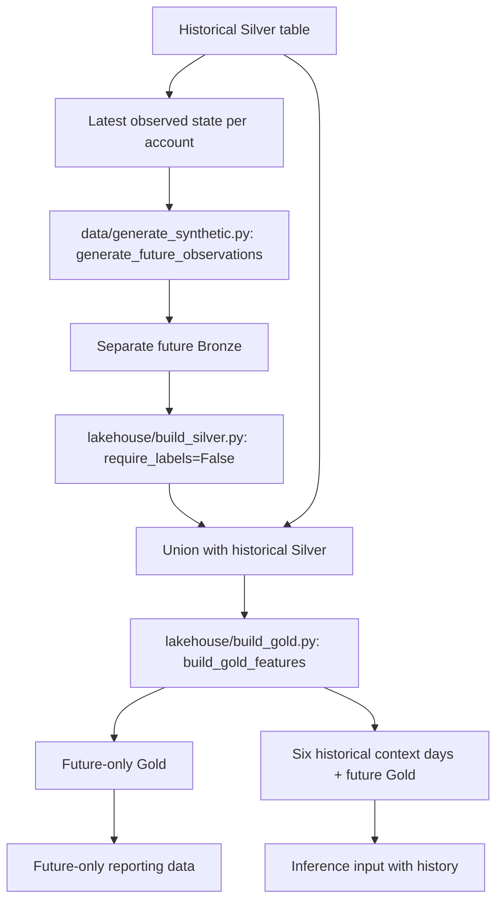

# Future synthetic inference data — first implementation

This batch extends the **existing** generation and Silver functions; it reuses the existing `build_gold_features()` unchanged. Existing historical training tables and the registered LSTM are not modified.

## Design



## Important data provenance

The generator implements a **reproducible approximate continuation** based on last observed per-account values; it cannot recover the original simulator's unpersisted latent stress, credit limit or random-number state. It produces no `risk_state` targets. These generated records are future-relative to the *historical dataset*, not a real bank feed.

The historical generator's existing `generate_financial_timeseries()` behavior stays untouched. The Silver default remains `require_labels=True` for training. Inference calls `require_labels=False` and never imputes/fits target labels. The Gold feature formulas are shared between training and inference.

## Databricks — safe dry run

```python
from finance_ml.pipelines.future_data_pipeline import prepare_future_data

result = prepare_future_data(spark, n_future_days=14, seed=84, persist=False)
print('Historical end:', result['history_end'])
print('Future start:', result['future_start'])
print('Future rows:', result['gold'].count())
display(result['gold'].orderBy('account_id', 'date').limit(10))
```

After inspecting the outputs, `persist=True` writes four **separate** tables under the existing `finance_ml` catalog. It overwrites the target future tables on repeated runs; do not set `persist=True` before reviewing the names and grants.

The context table contains six historical timesteps per account, plus future Gold records, so seven-step sequences can predict early future dates. Boundary trimming still prevents predictions for the latest two days of a finite batch; a later arriving batch can resolve those dates without using unavailable future data.

## VS Code

The generator runs locally in pandas without Databricks. The complete future pipeline requires Spark access (Databricks or compatible Databricks Connect). Reproducible local/Databricks inference comparisons and prediction-table persistence will be implemented after verifying the future-data dry run.

## Tests

```powershell
python -m pytest tests/test_future_generation.py tests/test_future_silver.py -q
python -m pytest -q
```
