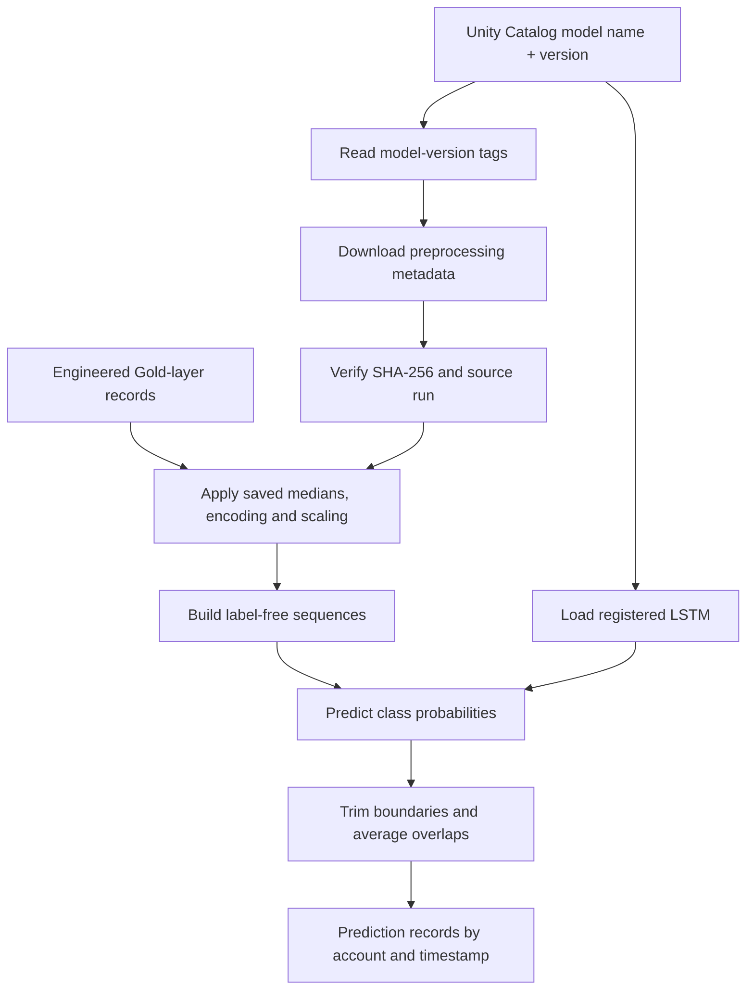
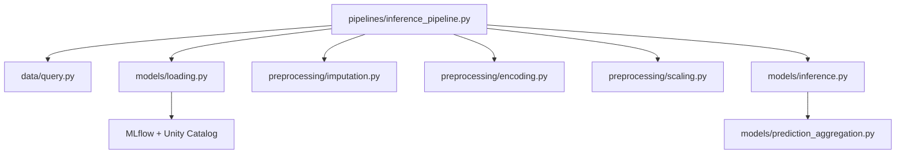

# Model inference pipeline — developer and user guide

## Overview

This pipeline performs **batch inference** for a **pinned Unity Catalog model version** using its associated, SHA-256-verified preprocessing metadata. It requires engineered Gold-layer features; it does not create the Silver/Gold transformations. It neither trains a model nor refits preprocessing statistics.

## Architecture



## Python dependency map



## Model and preprocessing contract

Default model: `finance_ml.models.lstm_risk_classifier`, version `1`. Model-version tags identify its metadata's MLflow run ID, artifact path and expected SHA-256. `models/loading.py` retrieves that metadata, verifies its checksum and source run, and loads the pinned Keras model. Version 1's metadata was **reconstructed**, not captured at the original training time; its provenance must remain documented.

Inputs require the engineered numeric and categorical Gold columns, `account_id`, and `date`. Labels (`risk_state`, `risk_state_name`) are **not required**. The pipeline reuses the training medians, categorical levels, scaler parameters and **exact ordered feature schema**, without fitting or discovering any statistics from inference data.

Each record in the output list includes `group`, `time`, `mean_probabilities`, `predicted_class` and `n_contributions`. Predictions at sequence boundaries are deliberately discarded, so a complete prediction is not guaranteed for the first and last timesteps of an account's batch.

## Databricks usage

Run from a notebook connected to appropriate compute and the repo's Python environment. Configure the MLflow experiment/tracking context and run:

```python
import mlflow
from finance_ml.pipelines.inference_pipeline import INFERENCE_CONFIG, run_inference_pipeline

mlflow.set_tracking_uri("databricks")
mlflow.set_registry_uri("databricks-uc")
config = {**INFERENCE_CONFIG, "query_method": "spark"}
result = run_inference_pipeline(config, spark=spark)
print(result["n_predictions"])
print(result["predictions"][:3])
```

Use the same repo path/import setup and `%uv sync --frozen` environment steps described in `docs/model_training_pipeline.md` where needed. Loading a model downloads its artifacts; it does not alter the registered model or run a remote serving endpoint.

## VS Code / Windows usage

Activate the project environment and install dependencies: `python -m pip install -e ".[dev]"`. Configure Databricks authentication and MLflow tracking/registry access. For remote Spark access, configure a compatible Databricks Connect version separately, then provide its `DatabricksSession` as `spark=`. Alternatively, connector/SQLAlchemy acquisition still requires a compatible SparkSession to run the existing Spark transformations. No Databricks Connect dependency is bundled in this project. Do **not** commit local tokens or `.env` files.

```python
from databricks.connect import DatabricksSession  # Optional, separately installed
from finance_ml.pipelines.inference_pipeline import run_inference_pipeline
spark = DatabricksSession.builder.getOrCreate()
result = run_inference_pipeline(spark=spark)
```

## Implementation limitations

- Batch-oriented, not streaming; sequence construction currently collects ordered rows to the driver. Use bounded batches.
- The pipeline assumes Gold features are already engineered consistently with training.
- Each group must contain at least seven records (default configuration); boundary trimming reduces timestep coverage.
- Unknown categorical levels follow the existing encoder policy (zero across known indicators). Missing required columns fail fast.
- No prediction-table write, serving endpoint, scheduler, or drift monitoring is implemented yet.
- Unit tests use injected clients/fakes. End-to-end validation with the real registered model and Databricks data remains necessary.

## Tests

```powershell
python -m pytest tests/test_loading.py tests/test_inference.py tests/test_inference_pipeline.py -q
```
