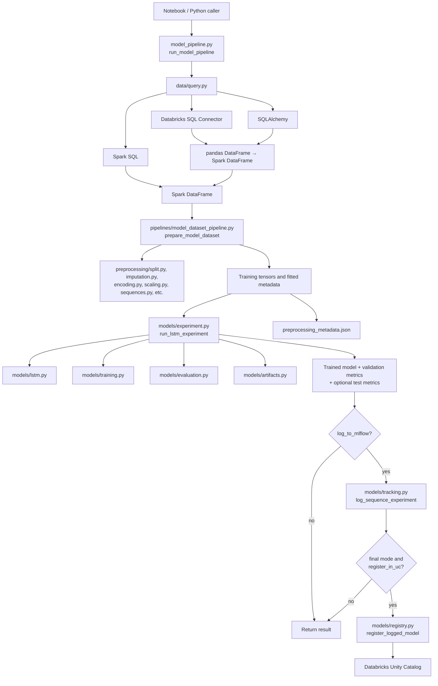

# Model training pipeline — developer and user guide

This guide documents the reusable training entry point at `src/finance_ml/pipelines/model_pipeline.py`, its dependencies, and how to execute it safely. Notebook 08 remains useful for comparing configurations interactively; the Python pipeline is the reusable implementation.

## 1. Architecture and module dependencies

The caller supplies a configuration dictionary and an active SparkSession. The coordinator delegates work to existing modules; importing it **does not** train a model.



**Important data contract:** `prepare_model_dataset()` currently expects a **Spark DataFrame**. Even when acquisition uses the SQL Connector or SQLAlchemy (which return pandas DataFrames), the coordinator converts the result to Spark. All three query methods therefore require a SparkSession for this implementation. Transferring an entire table through pandas can use significant driver memory; prefer `spark` for larger datasets.

### Responsibilities

| Module | Responsibility |
|---|---|
| `src/finance_ml/pipelines/model_pipeline.py` | Configure and coordinate acquisition, preprocessing, training, tracking and optional registration |
| `src/finance_ml/data/query.py` | Execute queries through Spark SQL, SQL Connector or SQLAlchemy |
| `src/finance_ml/pipelines/model_dataset_pipeline.py` | Time-aware splitting, train-fitted transformations, feature schema and sequence construction |
| `src/finance_ml/preprocessing/` | Underlying split, imputation, encoding, scaling and sequence utilities |
| `src/finance_ml/models/experiment.py` | Create a configurable LSTM experiment and evaluate predictions |
| `src/finance_ml/models/lstm.py` | Build the LSTM architecture |
| `src/finance_ml/models/training.py` | Training callbacks, early stopping and aggregated macro-F1 |
| `src/finance_ml/models/tracking.py` | MLflow metrics, parameters, artifacts and optional LoggedModel |
| `src/finance_ml/models/registry.py` | Optional Unity Catalog model registration and duplicate checks |
| `src/finance_ml/models/artifacts.py` | Training-history and learning-curve artifacts |

## 2. Configuration

Edit `CONFIG` near the top of `model_pipeline.py`, or (recommended for experiments) copy it and override values at the call site. The call-site approach does not change committed defaults.

```python
from finance_ml.pipelines.model_pipeline import CONFIG, run_model_pipeline

config = {
    **CONFIG,
    "query_method": "spark",  # "spark", "connector", "sqlalchemy"
    "source_table": "finance_ml.gold.account_features",
    "sequence_length": 7,
    "scaling_method": "mad",
    "lstm_units": (64,),
    "epochs": 2,  # Short integration test, not production training
    "run_mode": "development",
    "log_to_mlflow": True,
    "register_in_uc": False,
}

result = run_model_pipeline(config, spark=spark)
```

The `spark=` argument is **required in practice for every query method** because the preprocessing pipeline uses Spark. Omitting it raises a `ValueError`.

| Setting | Values / purpose |
|---|---|
| `query_method` | `spark`, `connector`, `sqlalchemy` |
| `source_table` | Fully qualified `catalog.schema.table` |
| `sequence_length`, `stride` | Sequence-window length and advancement |
| `scaling_method` | `mad` or `standard`; fitted on training records only |
| `train_fraction`, `validation_fraction` | Chronological split proportions; remainder is test |
| `n_classes`, `boundary_width` | Class count and positions removed at each sequence edge during aggregation |
| `lstm_units`, `dropout_rate`, `learning_rate` | LSTM architecture and optimizer |
| `epochs`, `batch_size`, `patience`, `seed` | Training behavior |
| `reduce_lr_on_plateau`, `lr_factor`, `lr_patience`, `min_lr` | Optional learning-rate scheduling |
| `run_mode` | `development` or `final` |
| `save_keras_checkpoint` | Save best Keras checkpoint under `artifact_dir` |
| `log_to_mlflow` | Log experiment run and artifacts |
| `mlflow_experiment_name` | Optional experiment name/path; `None` uses active/default MLflow experiment |
| `register_in_uc` | Register the newly logged final model in Unity Catalog |
| `registered_model_name` | `catalog.schema.model` registry destination |
| `artifact_dir` | Local/workspace location for training and preprocessing artifacts |

### Development versus final runs

| Behavior | `development` | `final` |
|---|---|---|
| Train and evaluate validation set | Yes | Yes |
| Evaluate held-out test set | No | Yes |
| Save Keras checkpoint | If enabled | If enabled |
| Log parameters, metrics and artifacts | If `log_to_mlflow=True` | Required |
| Log deployable MLflow LoggedModel | No | Yes |
| Tag run `final_model=true` | No | Yes |
| Register in Unity Catalog | Not allowed | If `register_in_uc=True` |

**Model registration is not model logging.** A final run with MLflow logging enabled produces a LoggedModel; registering it in UC is an additional optional operation. `register_in_uc=True` requires `run_mode="final"` and `log_to_mlflow=True`.

**Caution:** A final run automatically applies the `final_model=true` tag. Use final mode only for an approved configuration, since tag-based discovery in `registry.py` selects the latest final-tagged run in an experiment.

## 3. Running on Databricks (recommended)

1. Open the repository-backed Databricks notebook and select a compatible compute environment with access to `finance_ml.gold.account_features` and the chosen MLflow experiment.
2. From the notebook's Python context, set the repo as the working directory and make `src/` importable, as in notebooks 08 and 09. For example:

   ```python
   import os
   import sys
   from pathlib import Path

   username = dbutils.notebook.entry_point.getDbutils().notebook().getContext().userName().get()
   project_root = Path(f"/Workspace/Users/{username}/finance-timeseries-ml-platform")
   os.chdir(project_root)
   sys.path.insert(0, str(project_root / "src"))
   ```

3. In a **separate Databricks notebook cell**, synchronize dependencies using the committed lockfile:

   ```python
   %uv sync --frozen
   ```

   Restart the Python kernel with `%restart_python` when Databricks indicates that changed dependencies require it; rerun the setup/import cells after restarting. Do not use `%sh uv run` in a Workspace Git directory: it may try to create an unsupported local `.venv` there.

4. Set the MLflow experiment explicitly if you want the run in a particular location:

   ```python
   import mlflow
   mlflow.set_experiment("/Users/<workspace-user>/finance-timeseries-ml-platform_LSTM-model-selection")
   ```

   Replace `<workspace-user>` with the workspace-specific name. Alternatively, configure `mlflow_experiment_name` in your pipeline options.

5. Start with a short, non-registering development run:

   ```python
   from finance_ml.pipelines.model_pipeline import CONFIG, run_model_pipeline

   smoke_config = {
       **CONFIG,
       "query_method": "spark",
       "source_table": "finance_ml.gold.account_features",
       "epochs": 2,
       "run_mode": "development",
       "register_in_uc": False,
   }
   result = run_model_pipeline(smoke_config, spark=spark)
   print(result["metadata_path"])
   ```

6. Examine validation metrics, `artifacts/model_pipeline/preprocessing_metadata.json`, and the MLflow run. The development run will not create a UC model version.

7. For an approved configuration only, change `run_mode` to `final`, choose training settings, and optionally set `register_in_uc=True`. This triggers held-out test evaluation and deployable MLflow model logging; registration creates or reuses a UC version, subject to access permissions.

### Alternative acquisition modes

Change `query_method` to `connector` or `sqlalchemy` while **still passing `spark=spark`**. Those paths also require Databricks SQL connection credentials/configuration supplied by `load_databricks_config()`. They return pandas first, then convert to Spark, so they are less memory-efficient for large training tables. These modes are unit-tested but have not yet been verified end-to-end with the real Gold table.

## 4. Running from VS Code on Windows

### Install and check the project

In the repository root using PowerShell:

```powershell
python -m venv .venv
.\.venv\Scripts\Activate.ps1
python -m pip install -e ".[dev]"
python -m pytest tests/test_model_pipeline.py -q
```

The project currently targets Python `>=3.12,<3.13`; the development extra declares PySpark. These tests mock external training/query behavior and **do not need live Databricks**.

### Running the actual pipeline locally

The Python entry point **cannot simply be run with** `python src/finance_ml/pipelines/model_pipeline.py` using its default configuration: its `__main__` block looks for a global `spark` variable that normal Windows Python execution does not provide. Supply a working SparkSession explicitly.

For example, if you have a **compatible Spark session configured with Databricks Connect** and appropriate Databricks authentication, a separate local script could use:

```python
# Example only: requires a working Databricks Connect configuration.
from databricks.connect import DatabricksSession
from finance_ml.pipelines.model_pipeline import CONFIG, run_model_pipeline

spark = DatabricksSession.builder.getOrCreate()
config = {
    **CONFIG,
    "query_method": "spark",
    "epochs": 2,
    "run_mode": "development",
    "register_in_uc": False,
}
result = run_model_pipeline(config, spark=spark)
```

**Databricks Connect is not declared as a project dependency at present.** Install/configure a version compatible with your Databricks runtime before using this example. A locally created PySpark session is also possible, but it must be configured to access the remote dataset, or supplied with a suitable locally accessible equivalent. Merely calling `SparkSession.builder.getOrCreate()` does not grant access to Unity Catalog tables.

For `query_method="connector"` or `"sqlalchemy"`, the data-query utilities use `load_databricks_config()` credentials. Nevertheless, the returned pandas data must still be converted to Spark, so a SparkSession is still mandatory. Avoid checking secrets or `.env` files into Git.

### MLflow outside Databricks

The local MLflow library can use a local tracking store or connect to a remote server when separately configured. Installing MLflow does **not** automatically authenticate to the Databricks tracking server or Unity Catalog. Start locally with `run_mode="development"`, `register_in_uc=False`, and optionally `log_to_mlflow=False` if no tracking destination has been configured.

## 5. Outputs and inference contract

A call to `run_model_pipeline()` returns:

```python
{
    "experiment": ...,       # Trained model, history and evaluations
    "model_uri": ...,        # MLflow LoggedModel URI for final mode; otherwise None
    "registered_version": ...,  # UC model version if requested; otherwise None
    "metadata_path": ...,    # Saved preprocessing JSON path
    "feature_columns": ...,  # Ordered model-input features
}
```

The pipeline saves `preprocessing_metadata.json` with the final feature ordering, train-fitted imputation medians, category levels, scaling parameters, temporal split boundaries and sequence settings. These are needed to reproduce transformations for inference. **Saving metadata is not the same as having a completed inference implementation**; the inference pipeline must load and apply these parameters rather than refit them on new data.

The Keras checkpoint and training-history artifacts are stored under `artifact_dir` when enabled. MLflow run artifacts and logged models depend on run mode and settings. The project currently logs preprocessing metadata separately into MLflow's `training_artifacts/` directory.

## 6. Verified integration results (October 2026)

The following checks have been completed for the current feature branch:

| Check | Result |
|---|---|
| Local full test suite | **109 passed**, 16 non-fatal Keras/NumPy warnings |
| Databricks acquisition | Spark SQL from `finance_ml.gold.account_features` |
| Pipeline mode | Development; 2 epochs; UC registration disabled |
| Model input | 7 timesteps × 41 features |
| Validation macro-F1 | **0.8460639718827814** |
| MLflow run ID | `1263299b9bbb4bca8d400ce807f0fc42` |
| MLflow run status | `FINISHED` |
| Preprocessing metadata | 41 ordered features, 16 imputation medians, 22 scaling parameters, MAD scaling |
| Categorical levels | `business`, `checking`, `credit` |

The existing final model previously registered in Unity Catalog as `finance_ml.models.lstm_risk_classifier`, version 1, was created **before** this new pipeline's integration check. The new pipeline's automatic registration path has **not yet been exercised end-to-end**. SQL Connector/SQLAlchemy acquisition paths and a full final-mode training run likewise remain to be integration-tested.

## 7. Troubleshooting and limitations

| Symptom | What to check |
|---|---|
| `A SparkSession is required` | Call `run_model_pipeline(config, spark=spark)` and ensure the SparkSession works |
| Module import failures in VS Code | Activate `.venv`; run `python -m pip install -e ".[dev]"` |
| Missing MLflow experiment or unexpected run destination | Set `mlflow_experiment_name` or call `mlflow.set_experiment(...)` before training |
| Unable to access Gold table | Verify catalog grants, cluster/warehouse connection and selected Spark session |
| SQL connector authentication errors | Review environment-based Databricks credentials; never commit tokens |
| Large driver-memory use | Prefer direct Spark acquisition; pandas-based query paths materialize data on the driver |
| UC registration errors | Confirm final mode, MLflow logging enabled, model permissions and configured registry |
| Changed feature count or order | Use exact training feature schema and saved preprocessing metadata for inference |

**Current limitation:** this is a configurable LSTM training coordinator, not a general AutoML framework. It reuses the project's existing temporal split, preprocessing and evaluation conventions. Do not interpret the two-epoch development smoke test as a validated production model.
